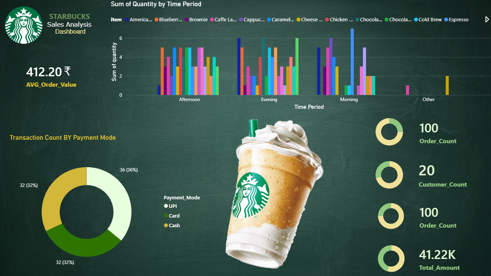
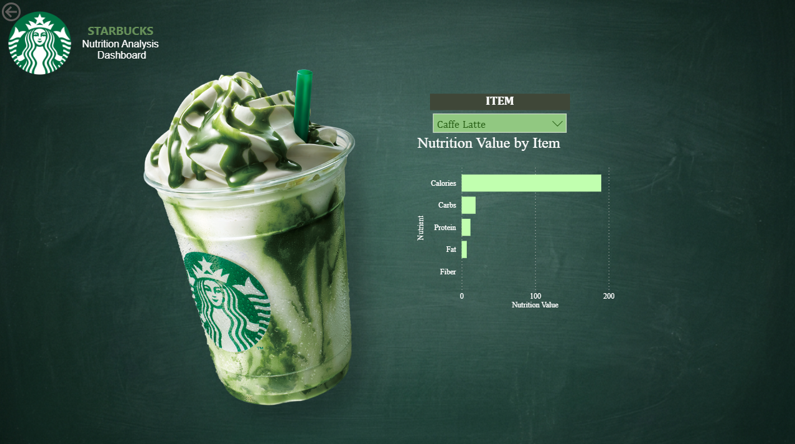
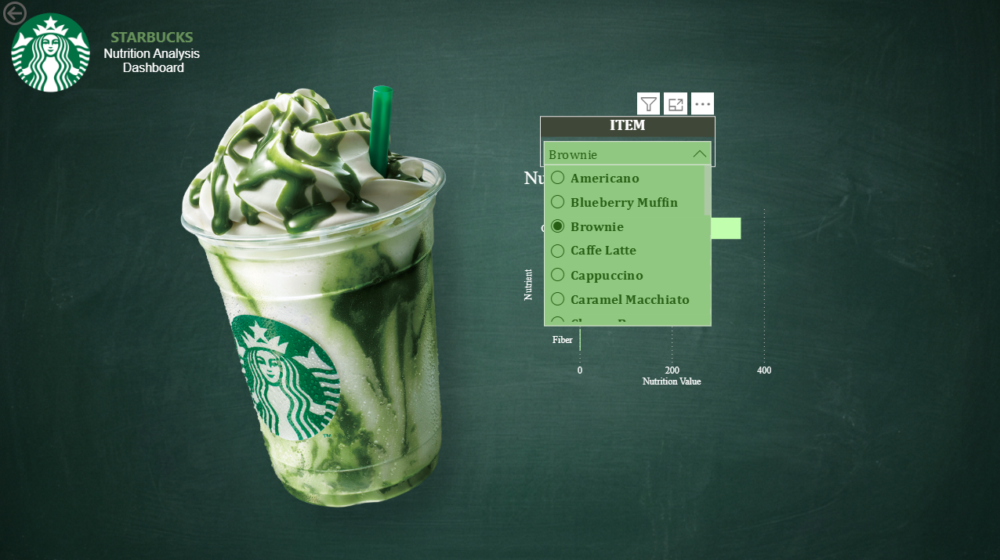
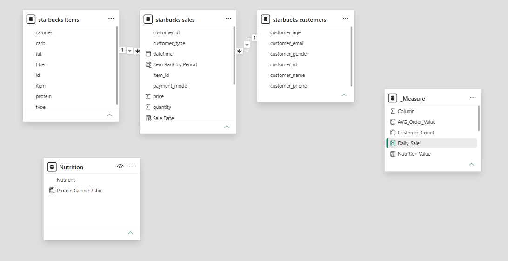
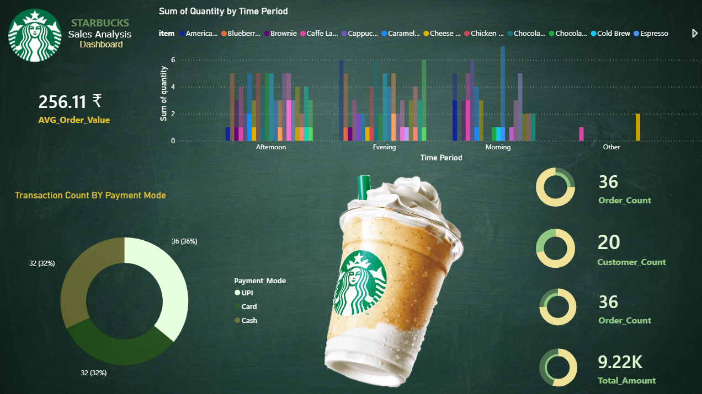

# Starbucks Sales Analysis Dashboard

A Simple interactive Power BI dashboard that digs into Starbucks sales data — what's selling, when, how customers are paying, and how it all stacks up nutritionally. Built on top of a MySQL database, with the data model and DAX measures doing the heavy lifting behind the scenes.

## What this project does

Goes beyond a single dashboard and actually connect sales data with customer and product information the way you'd see in a real BI setup. So this project pulls together transaction records, customer details, and item-level nutrition data into one relational model, then surfaces it through two dashboards:

- A **Sales Analysis Dashboard** covering revenue, order volume, payment methods, and time-of-day trends
- A **Nutrition Analysis Dashboard** where you can pick any item and see its full nutrition breakdown

## Goals

- Track overall sales performance with a set of KPI cards (orders, revenue, customers, average order value)
- Break down sales by time of day — morning, afternoon, evening
- See how customers are paying (UPI, card, or cash)
- Let users explore the nutrition profile of individual items interactively
- Tie it all together with a proper relational data model rather than one flat table

## The data

Everything lives in a MySQL database split across three tables:

**`customers`** — who's buying
| Column | Description |
|---|---|
| `customer_id` | Unique customer identifier |
| `customer_name` | Customer name |
| `customer_email` | Customer email |
| `customer_phone` | Customer phone number |
| `customer_age` | Customer age |
| `customer_gender` | Customer gender |

**`items`** — what's being sold, plus its nutrition info
| Column | Description |
|---|---|
| `id` | Unique item identifier |
| `item` | Product name |
| `calories` | Calories per item |
| `fat` | Fat content |
| `carb` | Carbohydrate content |
| `fiber` | Fiber content |
| `protein` | Protein content |
| `type` | Beverage/Food classification |

**`sales`** — the actual transactions
| Column | Description |
|---|---|
| `transaction_id` | Unique transaction identifier |
| `store_id` | Store identifier |
| `datetime` | Transaction date and time |
| `customer_id` | Customer identifier |
| `item_id` | Product identifier |
| `quantity` | Quantity purchased |
| `price` | Item price |
| `total_amount` | Transaction amount |
| `payment_mode` | UPI/Card/Cash |
| `customer_type` | New/Regular |

## Data model

`sales` sits at the center and connects out to `customers` and `items`, which is a pretty standard star-schema setup for this kind of analysis:

```text
customers
    │
    │ customer_id
    ▼
  sales
    │
    │ item_id → id
    ▼
  items
```

A few extra supporting tables were added in Power BI for measures and nutrition calculations.

## DAX measures

The report relies on a handful of calculated columns and measures to do the analytical work:

- `AVG_Order_Value`
- `Customer_Count`
- `Daily_Sale`
- `Order_Count`
- `Total_Amount`
- `Total_Quantity`
- `Nutrition Value`
- `Item Rank by Period`
- `Time Period`

## Dashboards

### Sales Analysis

KPI cards for average order value, order count, customer count, and total revenue, plus a column chart of quantity by time period and a donut chart showing the payment mode split. Everything's filterable, so you can slice by product or time period and watch the numbers update.



### Nutrition Analysis

This one's built around an item slicer , pick something like a Caffe Latte, Brownie, Americano, or Cappuccino, and the visuals update to show its calories, carbs, protein, fat, and fiber.

Funny part, I thought I could make diffrent visualizations for the Nutrition analysis , But guess what one slicer and stacked bar chart with some DAX measures was enough, keeping this just for the sake of designing. 





## Key features

**Time-period analysis** — transactions are grouped into Morning (6–11:59), Afternoon (12–16:59), Evening (17–21:59), and Other, making it easy to compare how demand shifts throughout the day.

**Payment mode analysis** — a quick donut-chart view of how transactions split across UPI, card, and cash.

**Product analysis** — look at any item by quantity sold, revenue generated, or how it performs across different times of day.

**Nutrition analysis** — the item selector makes it easy to compare nutritional profiles side by side.

## More screenshots

| | |
|---|---|
|  |  |
|  |  |
|  | |

## Tools used

- **MySQL** for the underlying database
- **SQL** for schema design, constraints, and loading the data
- **Power BI** for the dashboards themselves
- **DAX** for calculated columns, measures, and rankings

The full schema, sample data, and SQL scripts live in the project repository.

## How it fits together

```text
MySQL Database
      ↓
Customers + Items + Sales
      ↓
Power BI Data Connection
      ↓
Data Modeling & Relationships
      ↓
DAX Calculated Columns & Measures
      ↓
Interactive Visualizations
      ↓
Sales & Nutrition Dashboards
```


